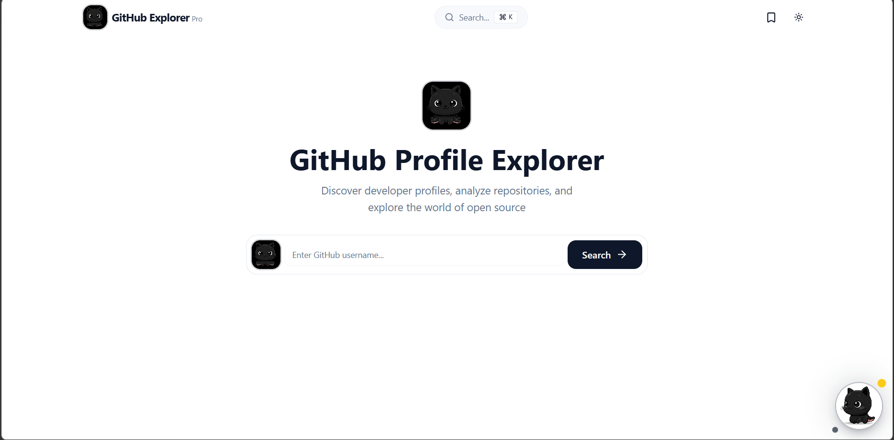

# 🚀 GitHub Explorer Pro

[](https://github-explorerpro-shadow.netlify.app)
[](https://github.com/JithinGK51)

**Project URL:** [https://github-explorerpro-shadow.netlify.app](https://github-explorerpro-shadow.netlify.app)

**GitHub Explorer Pro** is a high-performance, aesthetically stunning web application designed to visualize GitHub profiles with premium analytics and smooth animations.


---

## ✨ Features

- 📊 **Advanced Analytics**: Interactive charts powered by Recharts to visualize repository stats.
- 🎨 **Premium UI/UX**: Built with Framer Motion for sleek, buttery-smooth transitions.
- 🔍 **Real-time Search**: Instant fetching of any GitHub user profile.
- 📑 **Export Capabilities**: Download profile summaries as high-quality PDF or Images (HTML2Canvas & jsPDF).
- 🌙 **Modern Design**: Responsive, dark-mode-first aesthetic with Lucide-React iconography.

---

## 📸 Screenshots

<div align="center">
  
  <br />
  
  
</div>

---

## 🛠️ Tech Stack

- **Framework**: [Next.js 16 (App Router)](https://nextjs.org/)
- **Language**: [TypeScript](https://www.typescriptlang.org/)
- **Styling**: [TailwindCSS](https://tailwindcss.com/)
- **Animations**: [Framer Motion](https://www.framer.com/motion/)
- **Charts**: [Recharts](https://recharts.org/)
- **Icons**: [Lucide React](https://lucide.dev/)

---

## 🚀 Getting Started

To run this project locally, follow these steps:

### 1. Clone the repository
```bash
git clone https://github.com/JithinGK51/github.git
cd github-profile-explorer-pro
```

### 2. Install Dependencies
```bash
npm install
```

### 3. Setup Environment Variables
Create a `.env.local` file in the root directory and add your GitHub Personal Access Token (PAT):
```env
NEXT_PUBLIC_GITHUB_TOKEN=your_github_token_here
```
> **Note:** To create a token, go to **GitHub Settings > Developer Settings > Personal Access Tokens (classic)**.

### 4. Run Development Server
```bash
npm run dev
```
Navigate to `http://localhost:3000` to see your app!

---

## 🌍 Deployment on Netlify

This project is optimized for Netlify deployment.

1. **Build Settings**:
   - Build Command: `npm run build`
   - Publish Directory: `dist`
2. **Environment Variables**:
   - Add `NEXT_PUBLIC_GITHUB_TOKEN` in the Netlify UI under **Site Settings > Environment Variables**.

---

<div align="center">
  <h3>Created by JithinGK</h3>
  <p>Building the future of GitHub visualization.</p>
</div>
